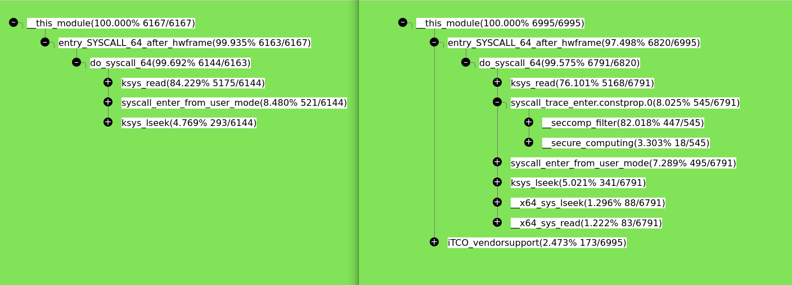

# A simple profiler
Fit for lightwight usage, minimum dependency

## Build
```
g++ -o profiler profiler.cpp
```
The code needs c++11 features, if an old g++ compiler is used, `-std=c++11` is needed.


## How it works
Profiler open  perf-event and collect sampled (pid,callchain) pair, whether userspace call-chain is collected depends on kernel version, a new kernel which can unwind user space stack is recommended.
For each (pid, callchain) pair, if this pid has not been symbol-collected, profiler would  parse elf information based on `/proc/[pid]/maps` and `/proc/[pid]/map_files/*`; Symbols are stored in an ordered structure, C++ map,  after symbols collected, each callchain address is binary searched for its  function name, and then full chain is inserted into a tree.


## Run
The profiler would open perf event with the cgroup which controls the specified pid
```
./profiler <pid>
```

To create a perf-event cgroup

cgroup v1
```
mkdir /sys/fs/cgroup/perf_event/<somename>
echo $$ > /sys/fs/cgroup/perf_event/<somename>/cgroup.procs
# run the target progrom
# run profiler with any pid within the cgroup
```
For cgroup v2, just use /sys/fs/cgroup/<somename>


## Example
When profiler terminated, a report is generated, following is an example showing the performance impact from seccomp when running a high-IO program within a docker container.

